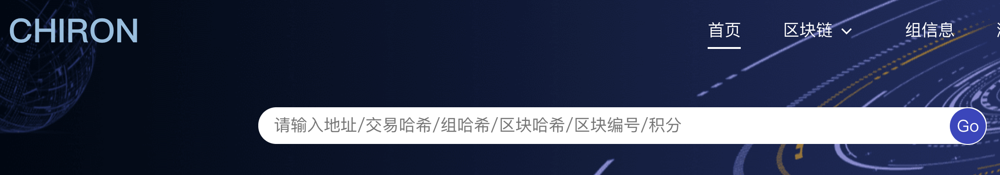

# 区块链浏览器

## 简介

 区块链浏览器是一个独立部署的区块链应用观察节点，它与区块链网络中您自己的Peer节点相连。通过它您可以搜索指定区块和交易的详细信息，有助于深入观察和分析链上数据的更多细节。当完成了链初始化后 并正常出块后，您可以根据以下指南继续部署区块链浏览器。

## 一、主要功能模块

 本小节概要介绍浏览器的各个模块，方便大家对浏览器有一个整体的认识。区块链浏览器主要的功能模块有：检索模块，铸块信息模块，组织管理模块，区块链信息展示模块。

### 1.1检索模块
 主要支持 节点和用户地址/交易哈希/组哈希/区块哈希/区块编号/积分检索，到达相应 详情页面。
   

### 1.2铸块信息模块
 主要支持 节点铸块信息和历史展示

### 1.3权限模块
 主要支持组织内联盟节点详细信息和用户权限信息展示，以及投票列表显示

### 1.4区块链信息展示模块
 主要展示了链上的具体信息，这些信息包括：节点铸块验块信息，区块信息，交易信息。
 

## 二、区块链浏览器搭建
 浏览器搭建前提条件是: 区块链浏览器展示的数据是从区块链上同步下来的。为了同步数据需要初始化配置（添加组织信息和节点权限信息），故在同步数据展示前需要用户先搭建好自己的区块链,或者按照chiron一键部署步骤可以把链和浏览器一键部署起来。

 当前版本我们提供的搭建方式：利用docker一键部署完成，前后端以及关系型数据库一键部署完成后。即可打开浏览器观察线上数据 保持和链上数据同步。

### 2.1一键部署
 基于Docker部署的区块链浏览器，仅依赖 Docker 和 docker-compose，以及一些镜像列表，具体参看一键部署文档。

## 三、功能介绍

### 3.1概览
 在搜索框中，您可以通过交易ID、区块高度，节点地址，合约地址，积分地址，用户地址几种方式进行查询账本详细数据
 以及最新区块高度，总的交易量，今日铸块量、交易量。以及最新的铸块信息和交易信息

### 3.2区块信息查看
 主要查看区块铸块信息，提案验证信息， 以及区块交易信息查看
  

### 3.3提案验证组信息查看
 查看某个块验块成员信息
 

### 3.4地址详情信息查看 
  包括节点，普通用户，积分详情，合约详情查看

### 3.5交易列表查看
 包括普通交易交易信息，块信息查看
 

### 3.6权限列表查看
包括组织列表，节点列表，用户列表，投票事项以及组织的细节等列表查看
 

点进具体的子菜单可以看到具体的信息：
 

### 3.7监控视图查看
监控视图用来监控当前联盟中的节点运行状况：包括节点的矿工角色以及当前实时块高以及上块时间，用来监控异常的节点
还可以查看最新的跳块高度以及对应的块的提案者信息
 

