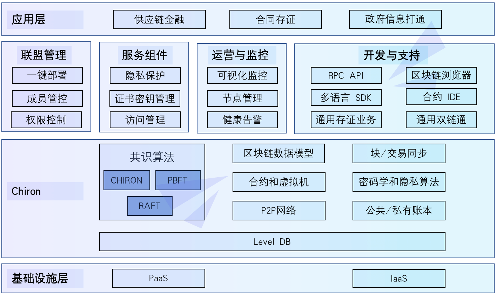

##############################################################
整体架构
##############################################################

整体架构上，Chiron划分成基础层、核心层、管理层和接口层：

- **基础设施层**:提供区块链一整套商业解决方案平台

- **区块链核心层**: 实现了区块链的核心逻辑：

  共识模块：Chiron共识算法的核心部分，包括VRF随机提案，BLS组协作验证以及一系列的密码学组件
  链模块：主要包括块的生成和校验，交易管理、执行和同步，分叉处理，虚拟机以及数据存储
  网络模块：主要包括网络的接入和退出，p2p节点高效通讯，以及各种复杂网络中实现网络穿透等技术

- **管理层**: 实现区块链的管理功能，包括联盟管理、服务组件、应用监控、开发者工具等

- **应用层**: 面向区块链用户，提供多种协议的RPC接口、SDK和交互式控制台

