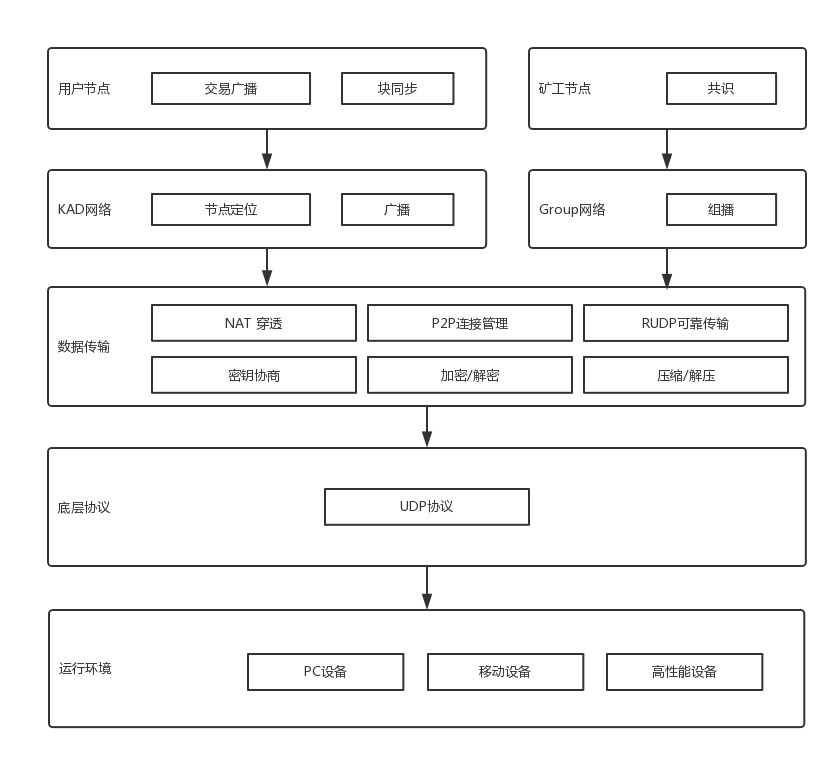

# p2p网络

## 一、简介
  对于商业应用来看，交易吞吐量和延时是企业最关心的交易性能指标。主要影响区块链的交易性能包括广播通信、信息加解密、共识机制、交易验证机制等等几个环节。由于区块链的核心技术之一就是P2P网络，因此P2P网络通信的效率是对性能的影响非常重要。
  Chiron共识机制的轻节点验证和组内、组间通讯极为依赖高性能的P2P网络实现。Chiron对传统的P2P技术做了较大的技术升级。主要包括：
  - 使用新型的NAT穿透技术（专利申请号：201811102186.6，201811101217.6）大幅提高节点在线率。
  - 针对Chiron以组为单位出块的方式，设计了双层KAD网络提高通讯效率。
  - 使用RUDP代替TCP，通讯延时降低35%左右。

## 二、p2p架构
   Chiron p2p架构如下:
 

## 三、NAT穿透：

   1.主流的NAT穿透使用标准STUN[13]作为解决方案，STUN将NAT设备分为四类，全锥型、限制锥型、端口限制锥型、对称型。我们对中国六万个网吧NAT设备进行了统计，其中全锥型5%，限制锥型7%，端口限制锥型58%，对称型30%，得到的理论穿透率为56%（5% x 100% + 7% x 100% + 58% x 70% + 30% x 12% = 56.20%）。另外，由于NAT防火墙的存在，被动的UDP包到达NAT设备时，在连接跟踪模块会产生相应的记录，引起的副作用会导致随后的端口预测失败，进而使整个穿透流程失败。STUN并没有考虑NAT防火墙的因素，按标准实现的穿透率仅在30%-40%左右。
   
   2.通过对linux内核协议栈的分析，我们从端口映射规律重新定义了NAT设备类型，并将之分为三类：主机端口、固定端口和对称端口。用这种分类法重新对六万个NAT设备进行统计，其中主机端口占比为75%，固定端口为23%，对称端口为2%，得到的理论穿透率为96%（75% x 98% + 23% x 98% + 2% x 0% = 96.04%）。针对路由器防火墙在接收到无相关性的被动数据包后会更改映射端口而导致随后的穿透失败，Chiron P2P设计了TTL动态调整算法，最终使实际穿透率基本达到了理论值的水平。
   
   内网穿透技术对比:
   
   | 内网穿透 | STUN | Chiron P2P |
   | --- | --- | --- |
   | 原理 | RFC3489 | Linux内核协议栈 |
   | 穿透率 | 30% | 96% |
   | 设备分类 | 全锥型/限制锥型/端口限制锥型/对称型 | 主机端口/固定端口/对称端口 |
   | 防火墙穿透 | 不支持 | 支持 |
  
## 四、组播网络：
   1.Chiron的所有节点都会加入到全局的KAD网络中，某个节点都将和8-16个邻居节点建立连接，由邻居节点间的通讯完成交易广播、块链同步和组链同步。
   
   2.针对分组的Chiron共识机制，Chiron构建了二层子KAD网络定位组成员节点，保证组成员间提案和验证的高效通讯。相比全局的KAD网络，二层组播网络保证了组内消息更快速的投递，同时减轻了对整个节点网络的负载。## 组播网络：

### 4.1 RUDP：

   对于高在线率节点网络和大量碎片验证数据交互的场景，RUDP相比TCP有着明显的优势。宏观来看，用RUDP代替TCP已是工业界的趋势，如谷歌提出的QUIC框架可以看做RUDP的超集，考虑到Chiron要求的高连通性和组内协作出块，Chiron在通讯层用开源且成熟的RUDP代替TCP。
  
   通讯协议对比:
   
   | 底层协议 | TCP | RUDP |
   | --- | --- | --- |
   | 内网节点穿透 | 难 | 易 |
   | 高质量网络传输速度 | 高 | 高 |
   | 中质量网络传输速度 | 中 | 高(ARQ快速重传) |
   | 低质量网络传输速度 | 中 | 高(FEC冗余传输) |