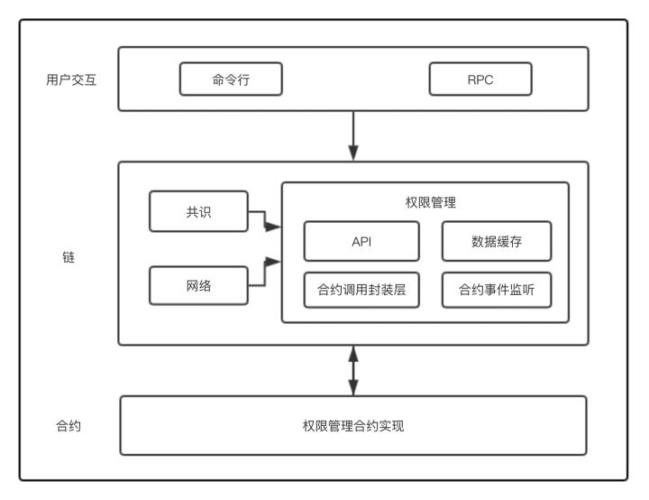
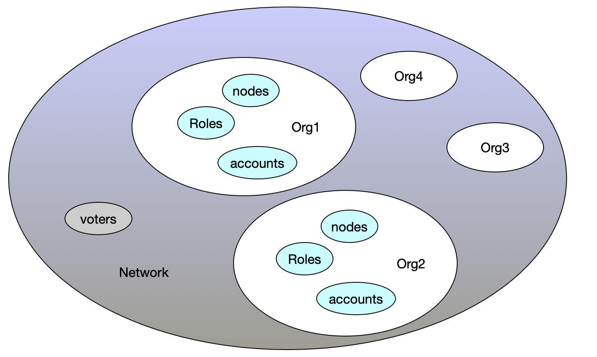
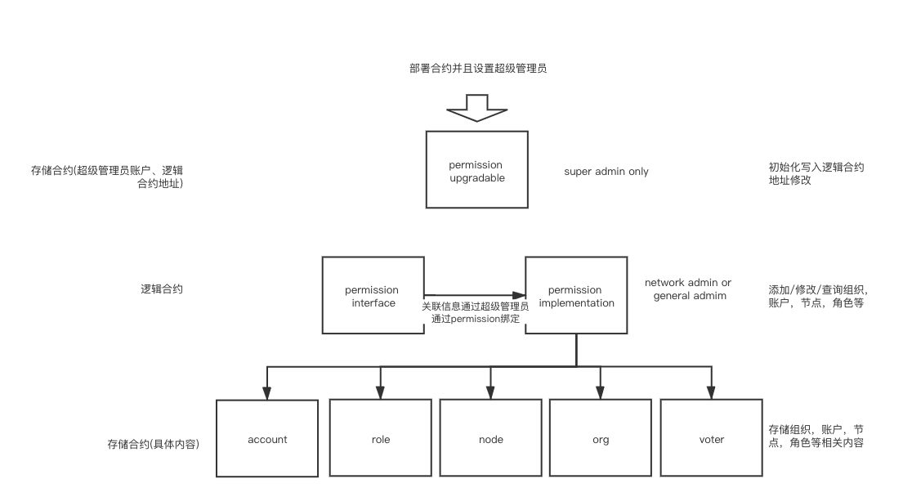

# Chiron 组织治理
Chiron组织治理牵涉到多参与方协调工作，激励机制，安全运营，监管审计等一系列的问题，核心是理清各参与方的责任，工作流程，构建顺畅的开发和运维体系，以及保障业务的合法合规，对包括安全性在内的问题能事先防范事后应急处理。为达成治理，需要制定相关的规则且保证各参与方达成共识并贯彻执行。 

一个典型的Chiron组织治理参考模型是各参与方共同组建Chiron组织委员会，共同讨论和决议，根据场景需要设定各种角色和分配任务，如某些机构负责开发，某些机构参与运营管理，所有机构参与交易和运维，采用智能合约实现管理规则和维护系统数据，委员会和监管机构可掌握一定的管理权限，对业务、机构、人员进行审核和设置，并在出现紧急情况时，根据事先约定的流程，通过共识过的智能合约规则，进行应急操作，如账户重置，业务调整等，在需要进行系统升级时，委员会负责协调各方进行系统更新。 

在具备完善治理机制的Chiron组织上，各参与方根据规则进行点对点的对等合作，包括资产交易、数据交换，极大程度提升运作效率，促进业务创新，同时合规性和安全性等方面也得到了保障。 

联盟治理权限架构图如下，权限管理合约，联盟管理会在后面详细说明 
 

## 一.Chiron组织自治主要从以下几方面考虑
### 1.安全性
安全性是个很大的话题，尤其是构建在分布式网络上多方参与的区块链系统。在系统层面，需要关注网络攻击、系统渗透、数据破坏和泄漏的问题，在业务层面需要关注越权操作、逻辑错误、系统稳定性造成的资产损失、隐私被侵害等问题。
安全性的保障要关注”木桶的短板“，需要有综合性的防护策略，提供多层面，全面的安全防护，满足高要求的安全标准，并提供安全方面的最佳实践，对齐所有参与者的安全级别，保障全网安全。
### 2.准入机制
准入机制指在无论是机构还是个人组建和加入链之前，需要满足身份可知、资质可信，技术可靠的标准，主体信息由多方共同审核后，才会启动Chiron组织组建工作，然后将经过审核的主体的节点加入到网络，为经过审核的人员分配可发送交易的公私钥。 在准入完成后，机构、节点、人员的信息都会登记到链上或可靠的信息服务里，链上的一切行为都可以追溯到机构和人。
### 3.权限控制
Chiron组织上权限控制即不同人员对各种敏感级别的数据读写的控制，细分可以罗列出如合约部署、合约内数据访问、区块数据同步、系统参数访问和修改、节点启停等不同的权限，根据业务需要，还可以加入更多的权限控制点。
权限是分配给角色的，可沿用典型的基于角色的权限访问控制（Role-Based Access Control）设计，一个参考设计是将角色分为网络管理员，组织管理员，节点，用户，每个角色还可以根据需要细分层级，完备的模型可能会很庞大复杂，可以根据场景需要进行适当的设计，能达到业务安全可控的程度即可。

## 二.Chiron组织管理
### 1.Chiron组织概述
Chiron组织是由多个机构共同参与管理的区块链，每个机构都运行着一个或多个节点。 其中的数据都只允许系统内不同的机构进行读写，并且由其机构成员共同来记录交易中的数据，Chiron组织中每一笔交易都需要其成员达成共识才能形成区块。 我们的系统基于智能合约的授权许可模型，该模型在管理节点、账户和账户权限管理上都有一定灵活度，模型整体框架如下图所示
 
该模型中：
  - Network：整个网络 
  - Organization：组织 
  - Account：账户 
  - Voter：能够进行投票的账户 
  - Role：角色 
  - Node：一个节点 

以下几点说明值得注意： 
  - Chiron组织划分为多个组织。 
  - 联盟管理员通过投票和表决来批准新的组织加入网路。 
  - 组织管理员能够进行RBAC的管理。 
  - 一个网络聚合了一群组织。网络层级有网络管理员账号 
  - 网络管理员可以提议和投票新组织加入网络，也可以指定某个账号为组织管理员账号。 
  - 组织管理员账号可以创建组织内角色、子机构、为自己机构下的账号赋予某种角色的功能，指定某个节点为本机构节点。 

### 2.Chiron 权限系统简介

chiron权限系统根据智能合约调用做权限控制,主要用以下7个合约做权限控制
 

权限合约分别是：

**`PermissionsUpgradable合约`**：只能通过guardian用户来调用的合约，一般在初始化的时候来绑定各个合约地址或者当`PermissionImplementation`合约逻辑更改来升级合约时候使用。

**`PermissionsInterface合约`**：接口合约，用户对权限的操作需调用该合约中封装的接口来调用，该合约会调用`PermissionsImplementation`合约来进行进一步调用。

**`PermissionsImplementation合约`**：通过上面的`PermissionsInterface`合约来进行统一调用的，该合约进而对底层的合约进行调用，考虑到以后存在由于逻辑变动而要升级合约的情况，该合约是可以被`guardian`重新绑定以进行升级操作。

**`OrgMgr合约`**：对组织进行存储的合约，包含组织列表，组织状态等等。`PermissionsImplementation合约`对组织的操作最终都会回到该合约中操作。通过`PermissionsImplementation合约`调用。

**`VoteMgr合约`**：进行投票管理的合约，该合约中存储投票者和各投票事项。一般在联盟层面上的操作都需要联盟管理员进行申请和投票两步操作才可以。通过`PermissionsImplementation合约`调用。

**`AccountMgr合约`**：对账户进行管理的合约。通过`PermissionsImplementation合约`调用。

**`NodeMgr合约`**：对节点进行管理的合约，可以指定某个节点是否有挖矿权限。通过`PermissionsImplementation合约`调用。

## 三.chiron permission APIs
**↓↓↓↓↓以下基于联盟内的操作都需要通过联盟管理员操作，且需要两步完成，即申请+批准↓↓↓↓↓**
#### add_org
用来在联盟中添加一个新组织时候使用。该方法仅可以被联盟管理员调用
##### Parameters
`_org_id`:新添加的组织id
`_account`:新添加组织中的账户id，该账户会被自动指定为该组织的管理员
`_node_id`:新添加组织中的节点id

* * *
#### approve_org
用来在联盟中投票通过一个新组织时候使用。该方法仅可以被联盟管理员调用，与前面的`add_org`方法是相关联的操作，前面通过`add_org`添加的组织需要联盟管理员调用此方法进行投票投票且超半数方可成功加入。
##### Parameters
`_org_id`:需要approve操作的组织id
`_account`:需要approve操作组织中的账户id，该账户会被自动指定为该组织的管理员
`_node_id`:需要approve操作组织中的节点id

* * *
#### update_org_status
由联盟管理员执行，当需要更改非联盟管理员组织的状态的时候使用。
##### Parameters
`_org_id`:需要更改状态的组织id
`_action`:操作符，`1`表示暂停组织，`2`表示将组织从已暂停的状态中恢复为激活状态

* * *
#### approve_org_status
由联盟管理员帐户执行，并用于批准组织状态更改建议。从网络管理员那里获得多数批准后，组织状态就会更新。
##### Parameters
`_org_id`:需要更改状态的组织id
`_action`:操作符，`1`表示暂停组织，`2`表示将组织从已暂停的状态中恢复为激活状态

* * *
#### assign_alliance_admin
由联盟管理员帐户执行，用于向联盟组织中添加一个新的联盟管理员账户时使用
##### Parameters
`_org_id`:联盟管理员组织id
`_account`:需要指派为联盟管理员的账户id

* * *
#### approve_alliance_admin
由联盟管理员帐户执行，用于批准向联盟管理员组织中新加管理员的建议。获得多数联盟管理员批准后，组织中便会增加一个有效的联盟管理员账户。
##### Parameters
`_org_id`:联盟管理员组织id
`_account`:需要批准为联盟管理员的账户id

* * *
#### add_miner_node
由联盟管理员帐户执行，用于向联盟中新添加一个挖矿节点时使用
##### Parameters
`_node_id`:该节点的id
`_org_id`:需要添加到目的组织的id
`_miner_role`:表示矿工类型。`1`表示提案矿工，`2`表示验证矿工, `3`表示两种身份的矿工：既是提案矿工又是验证矿工
`_vrf_pk`:vrf_pk
`_bls_pk`:bls_pk
`_weight`:表示矿工权重

* * *
#### approve_miner_node
由联盟管理员帐户执行，用于批准向联盟中新添加一个挖矿节点时使用，同样需要得到多数的联盟管理员批准后方可生效。
##### Parameters
`_node_id`:要批准的该节点的id
`_org_id`:要批准的需要添加到目的组织的id
`_miner_role`:要批准的矿工类型。`1`表示提案矿工，`2`表示验证矿工，`3`表示两种身份的矿工：既是提案矿工又是验证矿工
`_vrf_pk`:要批准的vrf_pk
`_bls_pk`:要批准的bls_pk
`_weight`:要批准的矿工权重

* * *
#### assign_node_to_miner
由联盟管理员帐户执行，用于将联盟中某个已存在的普通同步节点指定为矿工节点
##### Parameters
`_node_id`:该节点的id
`_org_id`:该节点所存在的组织的id
`_miner_role`:要分配的矿工类型。`1`表示提案矿工，`2`表示验证矿工，`3`表示两种身份的矿工：既是提案矿工又是验证矿工
`_vrf_pk`:vrf_pk
`_bls_pk`:bls_pk
`_weight`:矿工权重

* * *
#### approve_node_to_miner
由联盟管理员帐户执行，用于批准将联盟中某个已存在的普通同步节点指定为矿工节点的请求，需要得到多数的联盟管理员批准后方可生效。
##### Parameters
`_node_id`:要批准的该节点的id
`_org_id`:要批准的需要添加到目的组织的id
`_miner_role`:要批准的矿工类型。`1`表示提案矿工，`2`表示验证矿工，`3`表示两种身份的矿工：既是提案矿工又是验证矿工
`_vrf_pk`:要批准的vrf_pk
`_bls_pk`:要批准的bls_pk
`_weight`:要批准的矿工权重

* * *
#### remove_miner
由联盟管理员帐户执行，用于移除矿工信息。
##### Parameters
`_node_id`:要移除矿工的节点的id
`_org_id`:要移除矿工所在的组织的id
`_disable_node`:bool值，`true`表示让节点状态变为暂停状态，即停止同步。`false`表示节点还可以正常作为同步节点，但是不能作为矿工身份

* * *
#### approve_remove_miner
由联盟管理员帐户执行，用于批准移除矿工信息。当得到多数的联盟管理员批准后方可生效。
##### Parameters
`_node_id`:要批准移除矿工的节点的id
`_org_id`:要批准移除矿工所在的组织的id
`_disable_node`:bool值，`true`表示让节点状态变为暂停状态，即停止同步。`false`表示节点还可以正常作为同步节点，但是不能作为矿工身份

* * *

**↓↓↓↓↓以下基于组织内的操作都需要通过组织管理员操作↓↓↓↓↓**

#### add_account
由组织管理员帐户执行，用于向组织中新添加一个账户时使用。
##### Parameters
`_account`:新添加的账户id
`_org_id`:新添加的账户所从属的组织，该组织必须存在且为`approved`状态
`_access`:读写权限，分为四个等级。用户可指定`0`,`1`,`2`三个等级，高级别兼具有低级别的权限：
`0`:ACCESS_READONLY，只读权限
`1`:ACCESS_TRANSACT，可以发送交易  
`2`:ACCESS_CONTRACT_DEPLOY，可以部署合约  
`3`:ACCESS_FULL_ACCESS，全访问权限
`_is_admin`:bool值，表示该账户是否为管理员
**注意：如果`_is_admin`设置为true时，`_access`的值不能为`0`只读状态**

* * *
#### update_account_status
由组织管理员帐户执行，用于更改组织中某个账户的状态时使用。
##### Parameters
`_account`:要更改的账户id
`_org_id`:要更改的账户所从属的组织
`_action`:操作符，`1`表示暂停使用该账户，`2`表示将已暂停的账户恢复为激活状态

* * *
#### update_account_access
由组织管理员帐户执行，用于更改组织中某个账户的读写权限时使用。
##### Parameters
`_account`:要更改的账户id
`_org_id`:要更改的账户所从属的组织
`_access`:想要更改的目的读写权限，分为四个等级。用户可指定`0`,`1`,`2`三个等级，高级别兼具有低级别的权限：
`0`:ACCESS_READONLY，只读权限
`1`:ACCESS_TRANSACT，可以发送交易  
`2`:ACCESS_CONTRACT_DEPLOY，可以部署合约
`3`:ACCESS_FULL_ACCESS，全访问权限

* * *
#### add_node
由组织管理员帐户执行，用于向组织中新增一个同步节点时使用。
##### Parameters
`_node_id`:新增的节点id
`_org_id`:新增节点所从属的组织id

* * *
#### update_node_status
由组织管理员帐户执行，用于更改组织中某个节点的状态时使用
##### Parameters
`_node_id`:新增的节点id
`_org_id`:新增节点所从属的组织id
`_action`:操作符，`1`表示暂停该节点，`2`表示将已暂停的节点恢复激活状态

账户权限说明：

| 权限 |值  |说明|
| --- | --- | --- |
| ACCESS READONLY | 0 | 只读权限 |
| ACCESS TRANSACT | 1 | 发送交易权限，同时具备0权限 |
| ACCESS CONTRACT DEPLOY | 2 | 部署合约权限，同时具备0，1权限 |
| ACCESS FULL ACCESS | 3 | 全访问权限，为联盟管理员特有，同时具备0，1，2权限 |

节点矿工类型说明：

| 矿工类型 | 值 |
| --- | --- |
| PROPOSAL MINER | 1 |
| VERIFY MINER | 2 |
| PROPOSAL AND VERIFY MINER | 3 |

节点状态说明：

| 状态描述 | 值 |
| --- | --- |
| NOT IN LIST | 0 |
| PENDING APPROVAL | 1 |
| ACTIVE | 2 |
| PENDING SUSPENDED | 3 |
| SUSPENDED | 4 |

矿工状态说明：

| 状态描述 | 值 |
| --- | --- |
| MINER NOT VALIDATED | 0 |
| MINER PENDING VALIDATED | 1 |
| MINER VALIDATED | 2 |
| MINER PENDING ABOLISH | 3 |

组织状态说明：

| 状态描述 | 值 |
| --- | --- |
| NOT IN LIST | 0 |
| PROPOSED | 1 |
| APPROVED | 2 |
| PENDING SUSPENSION | 3 |
| SUSPENDED | 4 |
| PENDING SUSPENSION REVOKE | 5 |

账户状态说明：

| 状态描述 | 值 |
| --- | --- |
| NOT IN LIST | 0 |
| PENDING APPROVAL | 1 |
| ACTIVE | 2 |
| SUSPENDED | 3 |

投票类型：

| 投票类型 | 值 |
| --- | --- |
| VOTE OP ADD ACTIVITY ORG | 1 |
| VOTE OP SUSPEND ORG | 2 |
| VOTE OP REVOKE SUSPEND ORG | 3 |
| VOTE OP ASSIGN ALLIANCE ADMIN | 4 |
| VOTE OP REMOVE ALLIANCE ADMIN | 5 |
| VOTE OP ADD MINER NODE | 6 |
| VOTE OP ASSIGN NODE TO MINER | 7 |
| VOTE OP REMOVE MINER | 8 |