# Chiron密码学和创新

## 一、Chiron密码学运用
 Chiron铸块流程:
 
 
 Chiron共识对轻节点随机采样，形成若干个验证组，组协作VRF算法产生的真随机数作为PRG函数的随机种子，产生的随机数来确定当前slot的验证组，全网重节点根据上一块区块的随机数，进行VRF分组，随机选出当前slot的提案组，提案成员给出若干个候选区块提案定向广播给当前slot的验证组，验证组以组协作方式来完成候选区块验证，并通过门限签名方式达成组内共识向组外广播。
   
 出于数据的不可篡改性，以及可追溯性，如上图所示，Chiron机制采用双链模型，区块链和组链，来记录整个数据链产生过程。同时考虑组内节点可能会形成组内携手作恶，所以组有存续周期，到期后会解散重新进入随机采样分组流程。所以当系统进入稳定状态，每当进入一个新纪元（epoch）都可能有新组生效，老组解散的情况发生，每个纪元的工作组列表会发生相应变动。Chiron组周期解释图如下图所示。 
  
 
 ### 新组创建——Shamir密钥分享
 
 
 具体执行步骤如下：
 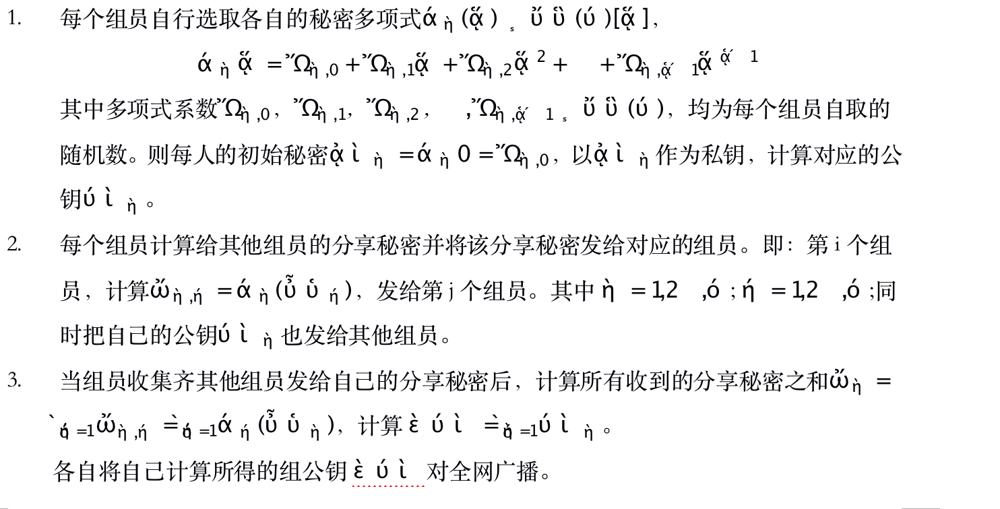

 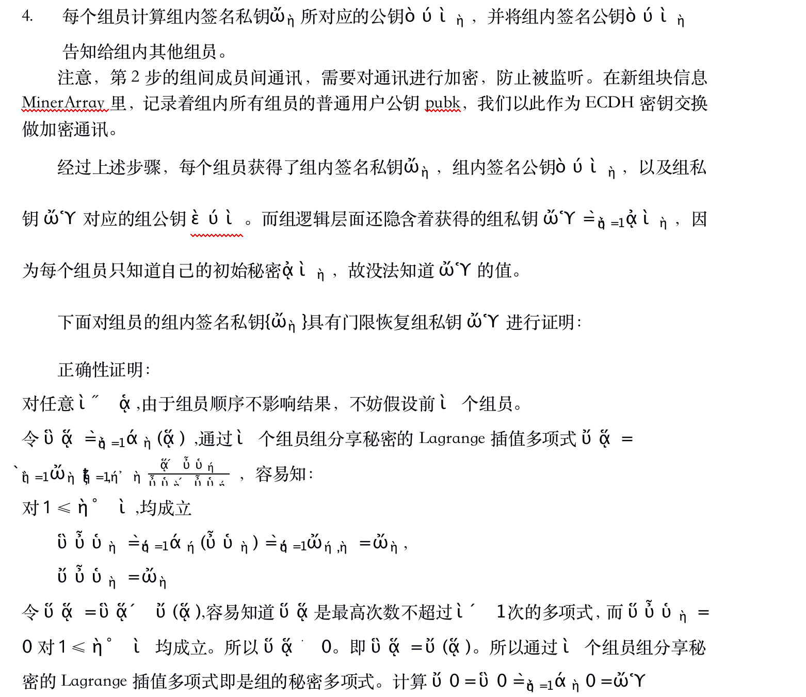
 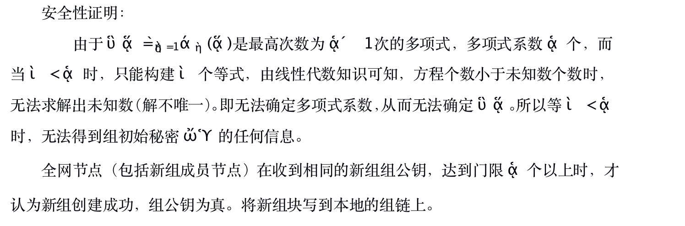

 ### 组动态增加组员
 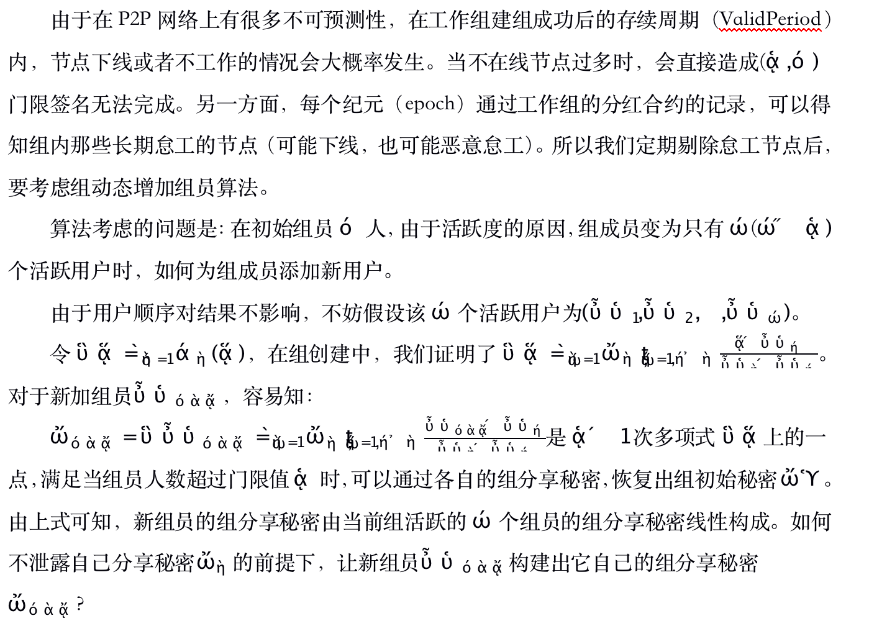
 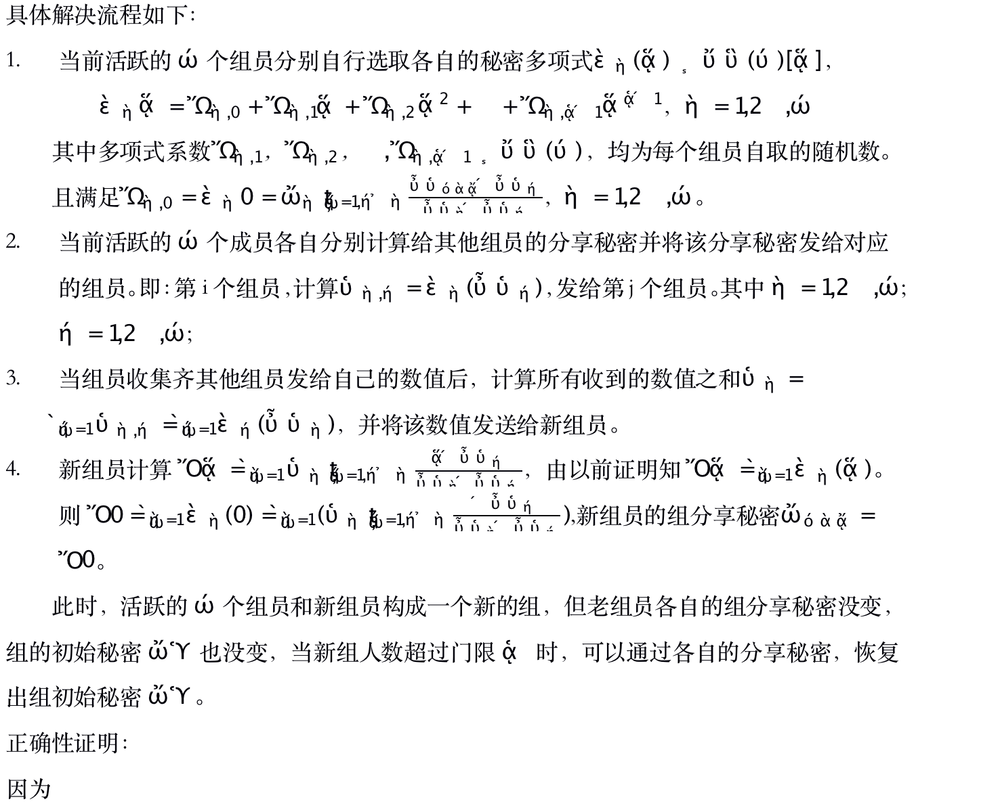
 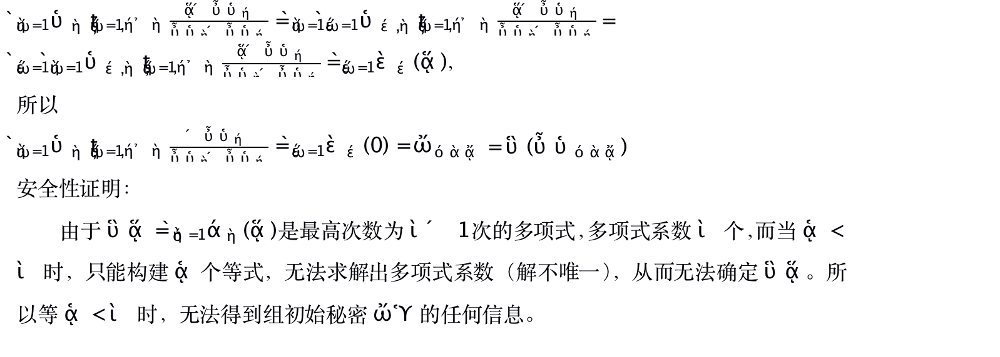

 ### 真随机数生成
 ### 结合ECDLP的Shamir秘密共享方案
 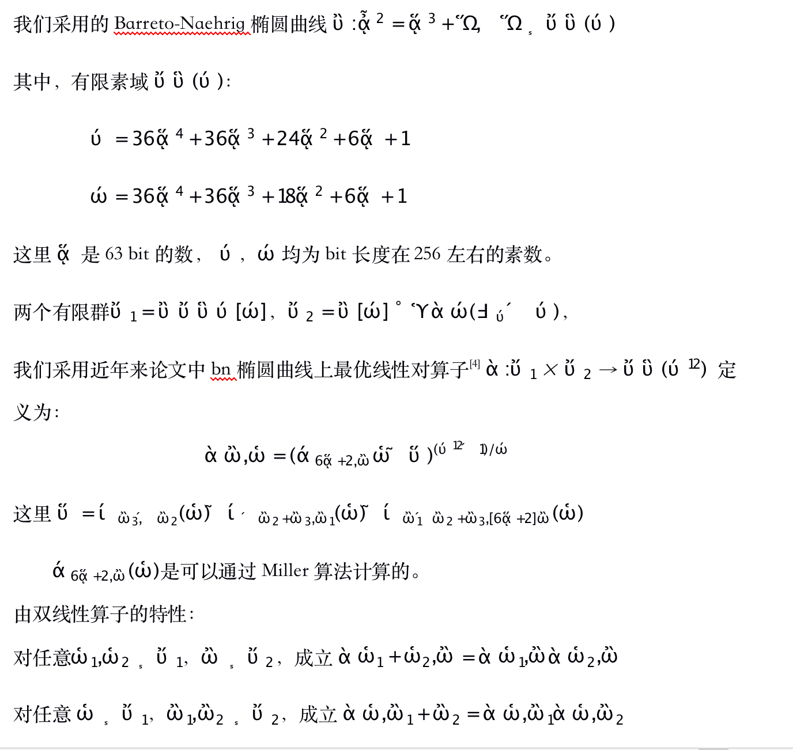
 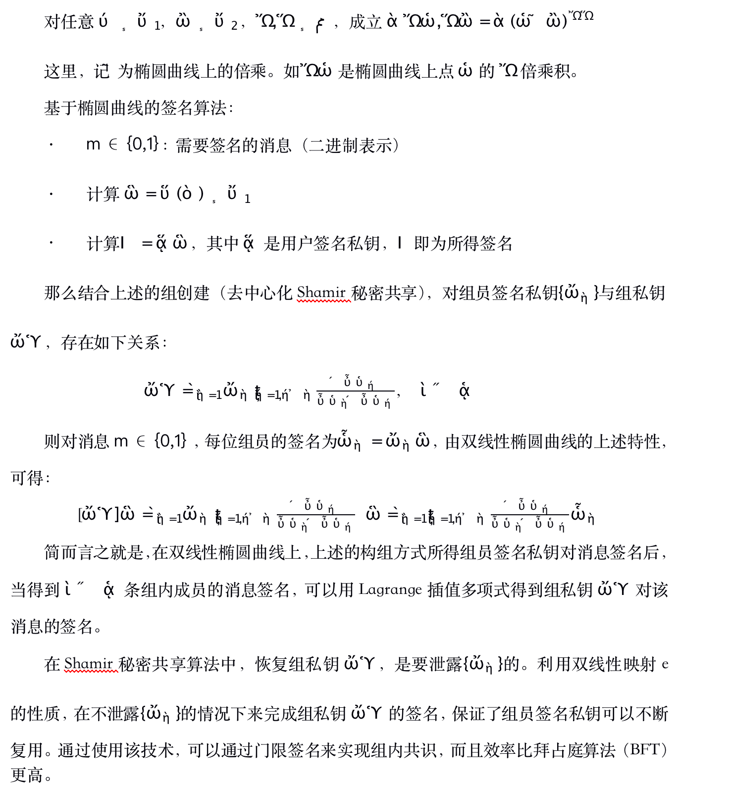
 
 ### 组协作VRF随机数
 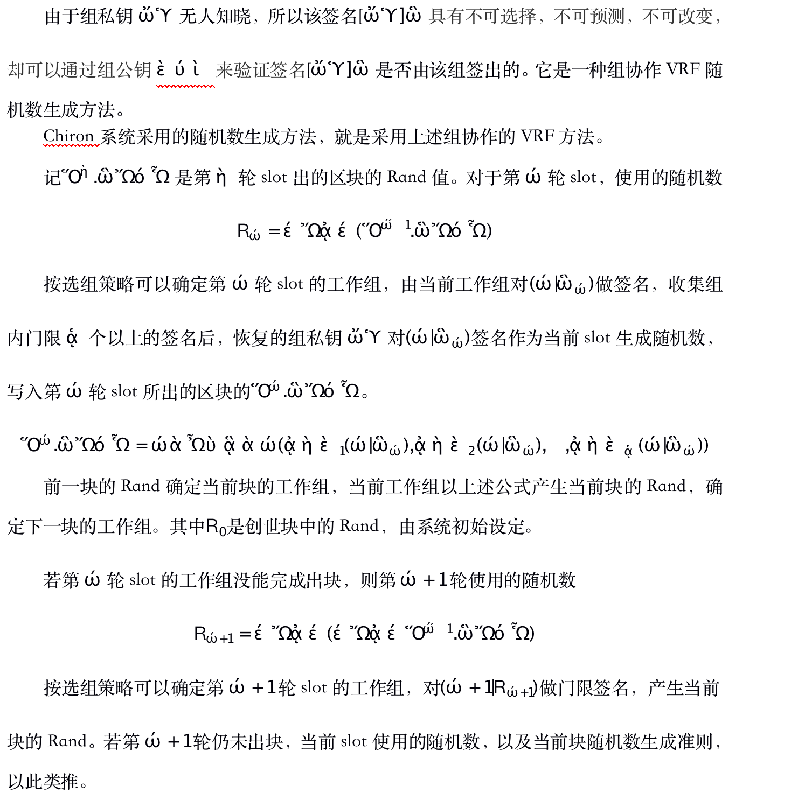
  
 ### 验证选组策略
 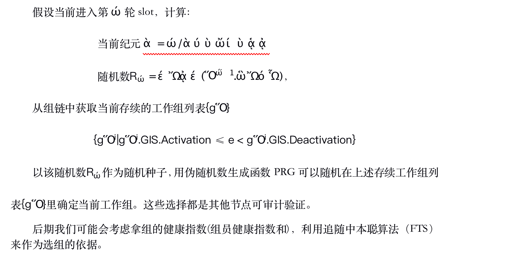

 ### 动态提案组
  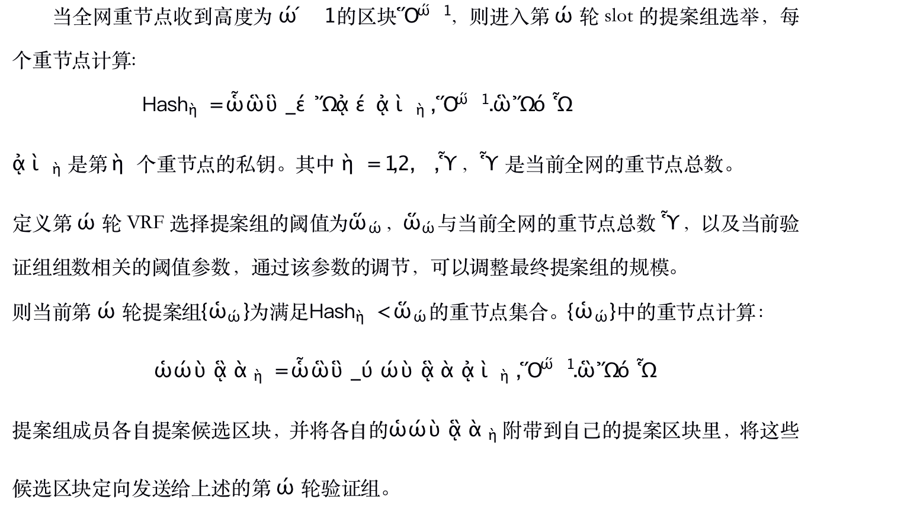
   
 ### 验证组验证签名
  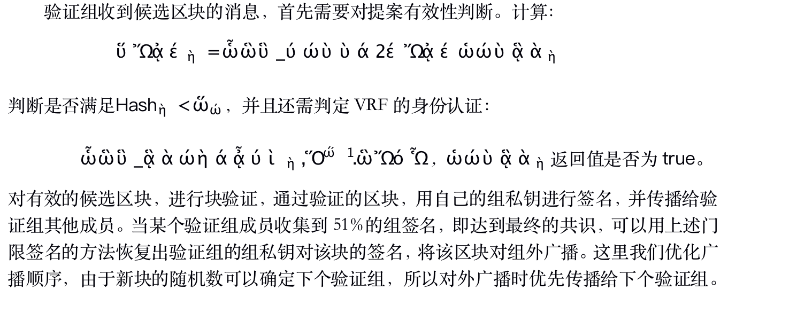
  
 ### 组外验证
  组外节点收到新块的消息，首先判断该块的验证组合法性，然后从块内容中获得组ID，然后通过组链上该组的公钥，以此来验证块上的组签名是否正确。若签名验证正确，本地上链成功，则将该块继续对外广播，否则停止对外广播。
  
 ### 收敛优化
由于提案组规模动态，可能会同时出多个候选区块。所以算法必须对候选区块快速收敛。这里我们规定的几个策略：
  - 验证组会优先提案组获得上轮的公证区块（完成组签名的区块，可能会多个），验证组会对上轮区块的权重进行优先处理。
  - 验证组签名时，当某个候选区块达成组共识被广播时，就不再对该轮的其他候选区块签名
 
 ### 通讯优化
 
 参考比特币的P2P网络的传播性能：1KB消息，在1秒钟内完成全网95%的传播，而1MB消息需要1.5分钟完成全网95%的传播。我们考虑到组成员散布在世界各地，而且工作组会以多个区块的方式提出候选区块，所以必须对通讯做相应的优化。我们考虑采用组内以Block header传给验证组。组内对block header的的Hash达成强一致，仅仅保证了block内容以及时序。用户账户是否存在double-spending没法验证。所以我们是在快速对hash达成一致后，等交易同步到本地后，由上链时的账户状态验证来保证交易的有效性。这样可以达到更高的共识效率。如果提案节点是诚实的，这样的流程效率比传统的以整个block（包含区块内所有交易内容）为消息传输的方式要高。如果提案节点是恶意的，这区块在上链时会验证失败，由上述的组外验证保证不会被传播，这样也保证了安全。另外，如果提案节点是恶意的，该块的验证组验证后会发起该块的分红合约，但上链验证失败使该区块上链失败。块链中分红合约与块链的不一致，可以作为作恶凭证，对作恶的提案节点给出相应的惩罚。比如降低出块节点的健康指数，保证金扣除等。
 
 ### 共识分析
 
 去中心化分析： 
 POW共识是高度去中心化的算法，但是随着矿机，矿池出现，它们成为POW共识的隐性中心。用户使用普通算力设备参与铸块，几乎无法收益。Chiron共识将节点分为重节点和轻节点，重节点每轮VRF秘密抽签随机获得提案权，单个重节点的提案概率和它的权益质押线性相关；轻节点随机分组，具体轮次由真随机数确定工作组，保证了每组有相同概率获得验证机会。最终区块的提案人以及验证组中参与验证的组员会有铸块奖励。 
 
 一致性和准确性分析： 
  Chiron设计了check point机制，每100块（5分钟左右）一个CP。出块组的验证阶段做一致性检查，提案和出块阶段做准确性检查。 
  
  全网非出块组在收到一个新块时，对内容做准确性检查，如果发现有问题，则先组内投票，当组内超过门限数量节点认为该块有问题，则以组为单位投票到一个特殊的智能合约。投票节点共享该投票的收益和惩罚。 
  
  每个新CP开始的组，需要检查该智能合约，如发现超过N个组在前一个CP内投票有异常的出块，则进行准确性检查。验证发现异常，回退到异常之前的CP重新开始。反之则继续当前CP。 
  
  对于大多数中小金额的交易，观察到90%的邻居节点已经在包含交易的块之后又新增了3个一致的出块，即可确认交易。对于大额交易，我们建议观察90%的邻居节点已经进入一个新的CP后确认交易。 