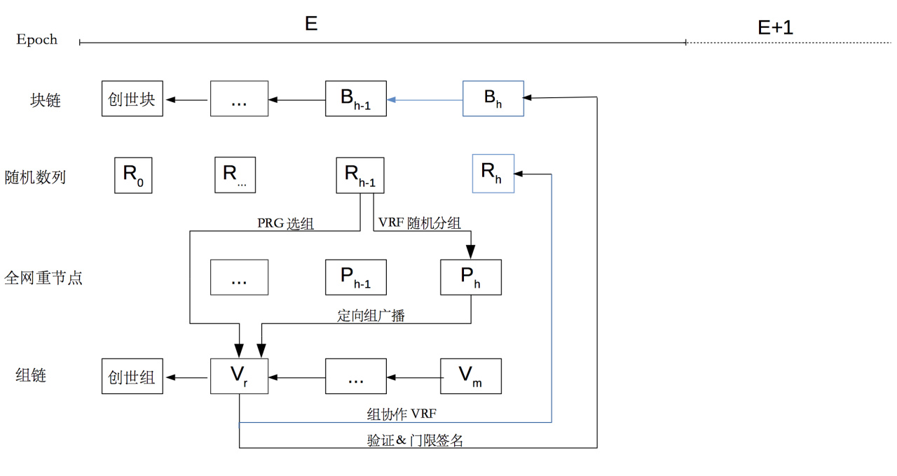
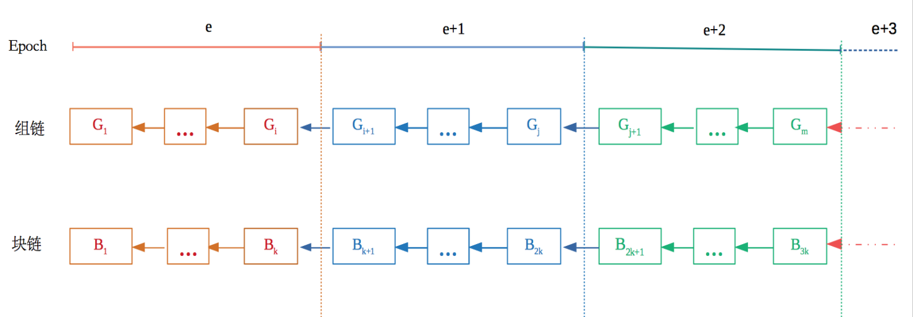
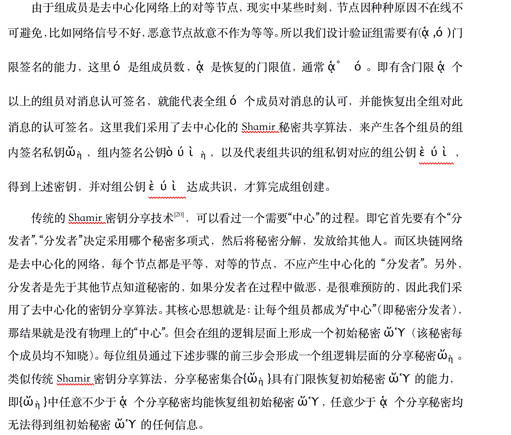

# Chiron密码学和创新

## 一、简介
  Chiron共识对轻节点随机采样，形成若干个验证组，组协作VRF算法产生的真随机数作为PRG函数的随机种子，产生的随机数来确定当前slot的验证组，全网重节点根据上一块区块的随机数，进行VRF分组，随机选出当前slot的提案组，提案成员给出若干个候选区块提案定向广播给当前slot的验证组，验证组以组协作方式来完成候选区块验证，并通过门限签名方式达成组内共识向组外广播。
  
  出于数据的不可篡改性，以及可追溯性，如上图所示，Chiron机制采用双链模型，区块链和组链，来记录整个数据链产生过程。同时考虑组内节点可能会形成组内携手作恶，所以组有存续周期，到期后会解散重新进入随机采样分组流程。所以当系统进入稳定状态，每当进入一个新纪元（epoch）都可能有新组生效，老组解散的情况发生，每个纪元的工作组列表会发生相应变动。如下图所示。 

## 二、Chiron铸块流程
 Chiron铸块流程:
 
 
 Chiron组周期解释图
 
 
 ### 新组创建——Shamir密钥分享
 
  

 
