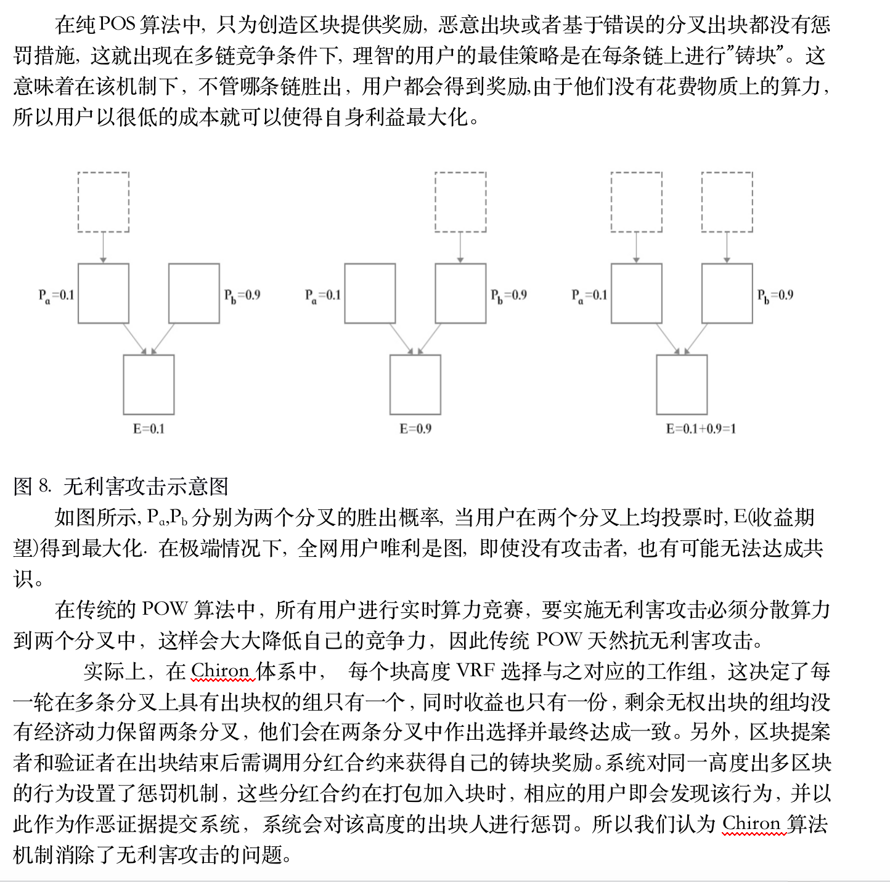
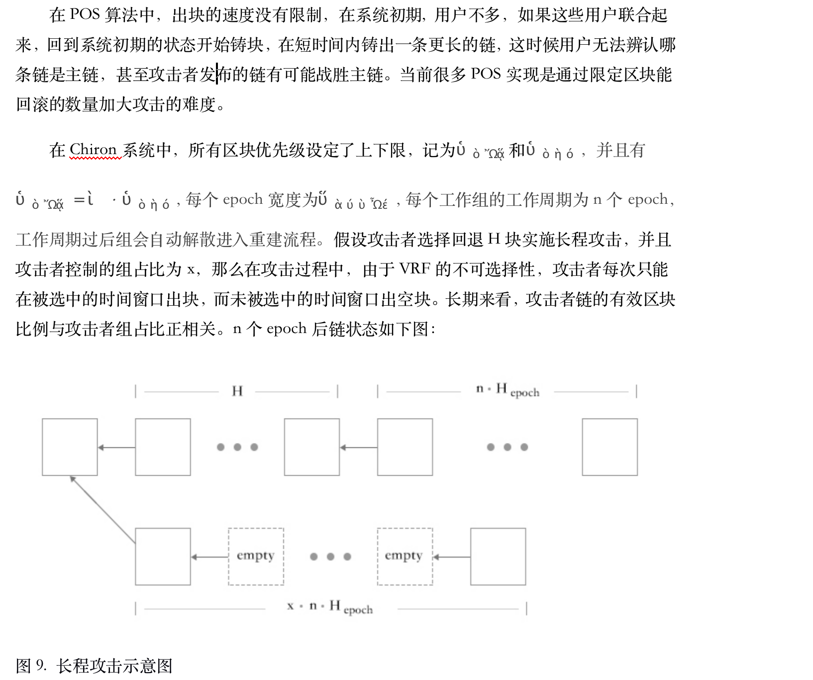
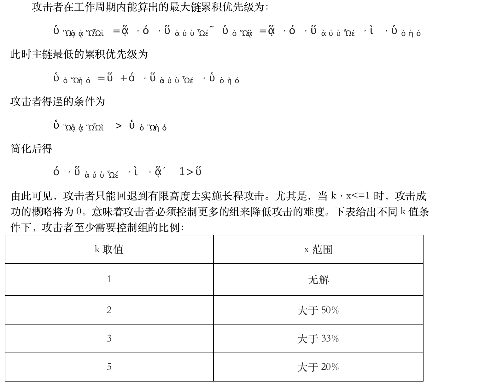
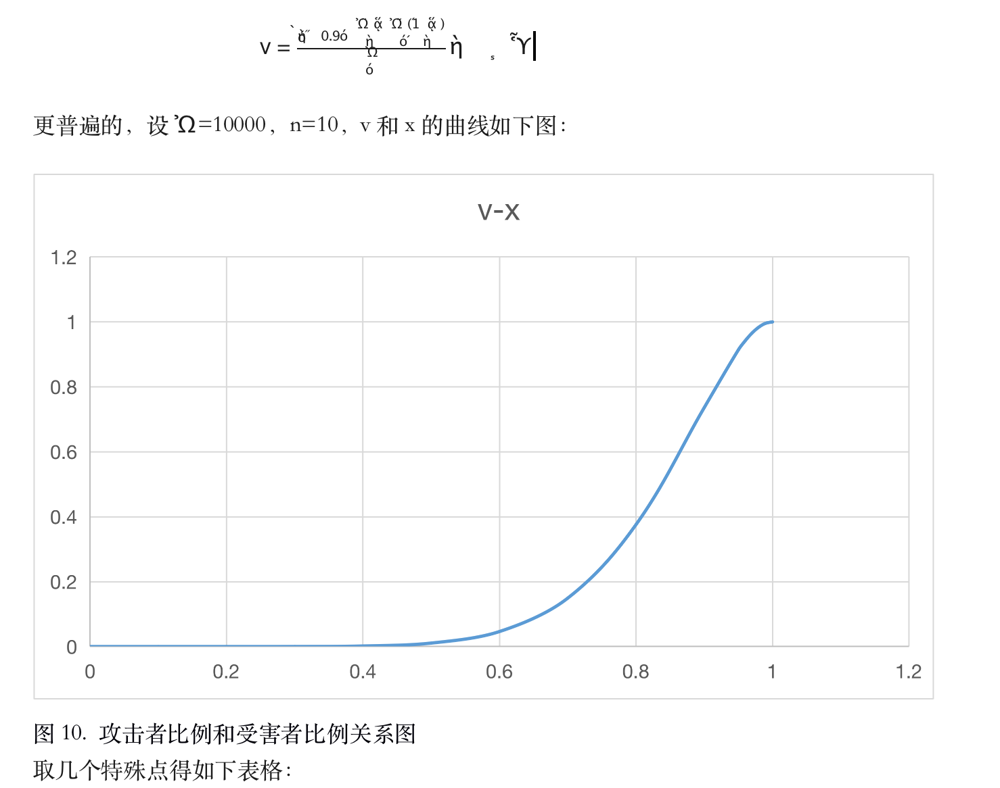

# 安全分析--攻击防御

## 一.无利害攻击(nothing at stake)
 

## 二.长程攻击(Long-range attack)
 
 

 事实上，上述推论成立的条件非常苛刻。首先，攻击者控制的所有组必须处在相同的存续周期中，这样才能保持攻击者的攻击力，但这在随机建组模型上，攻击者很难实现。其次，推论假设攻击者每次出块都能算出具有最大优先级的区块，并且诚实者都只算出最小优先级的区块，只要两个条件的一个不满足，都将大大减小H可选的范围。最后，诚实者会拒绝接受过期（n个区块以前）的区块，即系统限制了能回滚的区块数量。
 简而言之，难度区间的设定和区块时效限制了系统能回滚的块数量；随机分组策略和组定期重建机制使得攻击者无法长期保持高强度攻击，因此长程攻击在Chiron系统变得几乎不可能。
 
## 三.DDOS攻击
DDOS攻击主要是攻击者通过组织一批计算机，对服务节点发起大量的请求，从而使得服务节点忙于处理请求而耗尽资源，无法继续对外提供服务的攻击方式。比特币和以太坊全网节点进行POW计算，没有任何中心节点，因此天然地抗DDOS。我们认为去中心化程度将决定抗DDOS的安全程度。Chiron算法通过VRF在全网工作组中随机选择每一轮的验证组，表面上验证组成为了某一刻系统的中心，实际上由于VRF的随机不可预测性，这个中心每一轮都在变化，这是一个动态变化的中心，本质上也是去中心化的。
	
 对Chiron的DDOS攻击分为两类，一类是组外DDOS，即组外节点企图攻击某一时刻的工作组，致其不能出块。此类攻击者必须做到以下四点:
  - 1.在每一轮开始的时候实时计算得知当前时刻的工作组
  - 2.通过查询Chiron的底层网络, 得到组内每个成员的网络地址
  - 3.组织足够多的DDOS请求, 发给组内超过51%的成员, 致使他们瘫痪
  - 4.持续的执行上述3个步骤
前两点很容易实现； 

对于3）, 我们认为DDOS攻击一个节点最有效的方法是将其带宽打满。假设运行Chiron的用户平均带宽为10Mbps(这个需求在现代很容易满足), 则要打满100个节点的带宽, 攻击者的带宽至少是10 * 100 = 1Gbps, 再加上相应的机器电力成本, 这个代价已经不是普通人能够承受的。更重要的是，工作组和攻击者几乎同时开始工作，而且block-time的时间窗口很短，以至于在DDOS到来前工作组有很大概率已将块广播出去。 

对于4），即使攻击者在本轮攻击成功,当前组无法出块,当该组的时间窗口过后,下一个组自动开始下一轮的出块, 以此类推。攻击者必须持续高强度的发送DDOS请求给不同的目标机器。我们认为DDOS攻击对静态稳定的中心节点具有很大威胁，而对迅速变化的中心节点则威胁系数急剧下降，而且攻击成本更高。 

另外一类DDOS攻击是组内DDOS。由于提案人是VRF秘密抽签产生的，验证组成员只有收到候选区块提案才能知晓提案人身份，所以验证成员无法攻击提案者。另一方面，提案者的铸块奖励，需要验证成员帮其完成验证最终出块方能获得，两者是利益绑定的，所以提案人不会对验证成员进行DDOS。 

综上所述，VRF的随机不可预测保证了Chiron系统的去中心化特性，组内算力协作共享收益机制使得组内成员趋向互相合作，这两点保证Chiron系统抗DDOS攻击。 
## 四.女巫攻击(sybil attack)
女巫攻击的一种形式是攻击者注册大量的账号，并且使用这些账号进行铸块，以提高自己的收益。Chiron采用传统的权益质押的方式参与铸块，重节点提案概率和权益质押的数量线性相关。所以将手头权益分到多个账户来参与系统，并不能提升自己的收益。同样的，轻节点入选验证组时，选中的概率与其权益的质押线性相关，女巫攻击也是无利可图的。
	
另外一种攻击形式是攻击者围绕在诚实者周围, 通过一定手段与诚实者交互企图窃取利益. 在Chiron系统中, 节点之间交互类型主要有三种, 第一种是单向交互, 即接收者接收消息后通过合法性验证并进行存储即可, 如数据同步消息, 由于单向交互性使得攻击者基于此种交互并不能获取任何利益。第二种是双向交互, 即接收者接收消息并通过合法性验证后向发送者(或组内其他成员)进行相关反馈, 如块验证消息, 建组消息; 攻击者可以试图伪装成组员和被攻击者进行建组流程或者共同参与块验证, 企图获取利益。由于Chiron的建组流程是由指定的父亲组发起的, 建组的成员经过父亲组门限值以上的节点签名, 具有不可篡改, 可审计的特性, 因此被攻击者可以轻易的判断与之交互的节点是否属于组内成员。第三种是链式交互, 即接收者接收消息后只做简单的转发。显然这种简单转发不会让攻击者收益。最后值得强调的是, 上述攻击无效的前提是节点的私钥不泄露，Chiron系统所有的交互都不涉及私钥的传递。
	
综上所述，Chiron系统采用铸块参与度与设备健康指数相互反馈相互促进的机制使得攻击者无法作恶。安全可验证的消息通讯机制使得攻击者无法通过任何手段窃取被攻击者的利益。 
## 五.最后操作者攻击

Chiron系统中所有节点通过分组协作方式参与记账，每个区块由组内门限个以上成员签名，组外节点可通过组公钥进行验证，因此具有不可篡改的特性。最后操作者若企图修改数据，则会导致最终校验失败，攻击者无利可图。

另外，最后操作者选择不作为也是攻击的一种手段。然而，在Chiron系统中，任何组内节点都可以是最后操作者，不存在单点，只要有诚实节点，攻击者就不会得逞。极端情况下，攻击者控制了某个组所有成员，在最后出块时，选择不出，则系统会跳过本轮继续下一轮。攻击者同样无利可图。

## 六.双花攻击
双花攻击的常见手段是制造另一个能战胜主链的分叉。攻击者首先需要在某个组中控制超过一半以上的节点，并在轮到攻击者所控制的组出块时, 提前将自己的一笔交易广播出去, 同时自己也开始在另一个分叉铸块并把该交易打进块中, 等待该笔交易在主链中被确认(Chiron的确认时间很短)后，再把自己的分叉广播出去，若攻击者的分叉链难度大于当前主链新增的累积难度，就会被节点程序作为新的主链，如此一来，先前的交易就像不存在一样，以此达到攻击目的。此类攻击者的攻击策略和长程攻击类似，具体分析请参考长程攻击防御章节。

## 七.私自挖矿攻击
在比特币系统中，由于所有节点程序可以在每个高度上进行POW铸块，因此算力强的节点可以在挖到某块后，先藏着，并私自开始下一轮铸块，以此获得先机。

Chiron系统中所有节点通过分组协作方式进行铸块，每个节点挖出的块必须经过组内大多数节点的签名才能广播出去，因此私自铸块对单个节点并不成立。而组间的轮换完全由VRF决定，私自铸块并不能使组获得下一轮铸块权，因此私自铸块对组亦不成立。 
## 八.51%攻击
在纯POW的系统中, 51%攻击是致命的不可恢复的。因为攻击者拥有足够的算力挖出一条难度更大的更长的链去淘汰主链，而诚实者会渐渐接纳攻击者链，攻击者永久胜出。

Chiron系统将节点随机分配到不同的组, 51%攻击可能导致攻击者控制了绝大部分工作组。在这种情况下，主链将缓慢延长，攻击者链由于拥有更多的组而延长速度更快，但是诚实者会拒绝接受攻击者链，他们会一直坚持延长主链。此时绝大部分用户能轻易感知系统存在两条不同的链而不敢轻易交易，从而导致攻击者收益甚微，这与其发动51%攻击的成本完全不成比例。

如果一个普通用户随机连接的所有节点都被攻击者控制，则此用户由于无法感知异常而继续信任网络，我们认为这个用户是能给攻击者带来收益的，暂且称此类用户为受害用户。显然受害用户越多，攻击者收益越大。下面简单分析一下攻击者和受害用户的比例关系。

假设每个用户都随机连接的n个节点中有90%的节点都被攻击者控制，则该用户成为受害用户。假设全网节点数W，攻击者控制比例为x，则受害者比例为：

 

| 攻击者比例 | 受害者比例 |
| --- | --- |
| 0.5 | 0.01071 |
| 0.8 | 0.3757 |
| 0.9 | 0.7361 |
| 0.95 | 0.914 |
| 1 | 1 |

由此可知，当攻击者控制50%的节点时，受害者比例仅为1.07%；而理论上只有当攻击者控制了100%的节点时，攻击者才可以控制整个网络。如果受害者比例超过90%后，攻击者就有利可图，那么攻击者需要控制95%以上的节点。这个攻击的成本非常巨大。相反，当攻击者由于无利可图而渐渐退去，诚实者比例大于95%后，系统就能恢复正常。
	
综上所述并结合最近发生的多起针对低算力POW公链的51%攻击，我们认为Chiron系统能抗95%甚至更高的攻击（在系统冷启动和低算力状态进一步提高系统健康度阈值），因而具有更高的安全级别。
	
Chiron共识机制的单链性能达到3000TPS，并且保证了共识机制的高安全性，高去中心化，是至今为止的所有共识机制中给出去中心化，安全，性能三角不可能问题的最佳方案。Chiron共识机制从设计之初就考虑了系统的效率成本，充分利用了组闲置时间，设计了定期check point机制。

 

 
