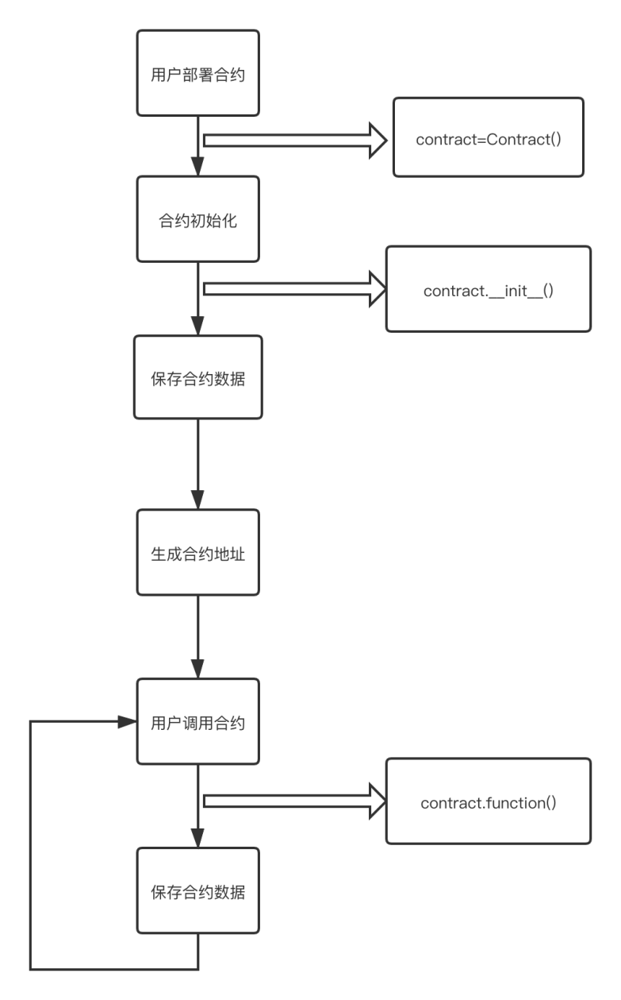

# 虚拟机和智能合约

## 智能合约概述
账户
  - 两类账户（它们共用同一个地址空间）： 外部账户 由公钥-私钥对（也就是人）控制； 合约账户 由和账户一起存储的代码控制. 外部账户的地址是由公钥决定的，而合约账户的地址是在创建该合约时确定的（这个地址通过合约创建者的地址和从该地址发出过的交易数量计算得到的，也就是所谓的“nonce”） 无论帐户是否存储代码，这两类账户对 TVM 来说是一样的。 每个账户都有一个键值对形式的持久化存储。其中 key 和 value 的长度都是256位，我们称之为存储。

交易
  - 交易可以看作是从一个帐户发送到另一个帐户的消息。它能包含数据和ZV币。
  - 如果目标账户含有代码，此代码会被执行，并以 payload 作为入参。
  - 如果目标账户是零账户，此交易将创建一个新合约 。
  - 合约地址是通过合约创建者的地址和从该地址发出过的交易数量(nonce)计算得到的。这个用来创建合约的交易的 payload 会被转换为 TVM 字节码并执行。执行的输出将作为合约代码被永久存储。这意味着，为创建一个合约，你不需要发送实际的合约代码，而是发送能够产生合约代码的代码。

智能合约的生命周期

 
 
一个简单的智能合约：
```
class Storage(object):  
    def __init__(self):  
        self.data = 0  
    @register.public(int)  
    def set_data(self, num):  
        self.data = num  
```
合约主要由合约代码和合约数据两部分组成，它们都位于部署合约时生成的地址上。示例合约定义了一个名为Storage的合约，它提供了self.data这个数据的状态存储，并提供了一个set_data接口来修改它。该合约只能提供简单的功能：它能允许任何人在合约中存储一个单独的数字，并且这个数字可以被世界上任何人访问。同时，任何人都可以再次调用 set_data，传入不同的值，覆盖你的数字，但是这个数字仍会被存储在区块链的历史记录中。

## 虚拟机概述

链内置的虚拟机是轻量级的Python解释器，并且针对智能合约使用场景，做了针对性优化、裁剪、改动。

虚拟机执行合约需要消耗资源，防止被用户恶意调用合约，使用Gas机制控制资源消耗。

|  |Gas  |单位|
| --- | --- | --- |
| 执行时间 | 1 | 微秒 |
| 写入Block | 1.9073486328125 | byte |
| 内存使用 | 0.03814697265625 | byte |
| 写入日志 | 0.095367431640625 | byte | 
| 写入stateDB | 0.3814697265625 | byte | 
| 交易 | 1000.54321289062 | Gas | 

opcode费用详情

|opcode|Compute (µs)| means|
| --- | --- | --- |
|MP_BC_LOAD_CONST_FALSE| 2|a=FALSE|
|MP_BC_LOAD_CONST_NONE|2|a=None|
|MP_BC_LOAD_CONST_TRUE|2|a=TRUE|
|MP_BC_LOAD_CONST_SMALL_INT|2|定义一个int值a=1|
|MP_BC_LOAD_CONST_STRING|3|定义一个string值a="tas"|
|MP_BC_LOAD_CONST_OBJ|3|加载object|
|MP_BC_LOAD_NULL|2|加载None数据|
|MP_BC_LOAD_FAST_N| 5|声明一个内嵌函数|
|MP_BC_LOAD_DEREF|2|为传入参数赋值def funA(a=1)|
|MP_BC_LOAD_NAME|5|a=funA(),根据类/函数名加载类/函数|
|MP_BC_LOAD_GLOBAL| 5|加载全局变量 funcA中声明一个global的变量x，外部funcA.x|
|MP_BC_LOAD_ATTR|3|获取init方法中的的属性|
|MP_BC_LOAD_METHOD| 5|调用class A中的funcA()方法|
|MP_BC_LOAD_SUPER_METHOD|5|调用父类中的方法|
|MP_BC_LOAD_BUILD_CLASS| 3|声明一个class，如class Foo():|
|MP_BC_LOAD_SUBSCR| 8|获取子数组中数据，如:b=a[0:3]|
|MP_BC_STORE_FAST_N|5|存储内嵌函数|
|MP_BC_STORE_DEREF| 5|存储预定义的数据|
|MP_BC_STORE_NAME|5|存储预定义的class name或者func name|
|MP_BC_STORE_GLOBAL|5|存储全局变量|
|MP_BC_STORE_ATTR|5|存储类属性，如:class T():__init__()| t = T()|
|MP_BC_STORE_SUBSCR|5|添加map的value值，如m[2] = 3|
|MP_BC_DELETE_FAST| 8|删除内嵌函数|
|MP_BC_DELETE_DEREF|8|删除defer的值|
|MP_BC_DELETE_NAME| 8|删除一个变量/函数/类|
|MP_BC_DELETE_GLOBAL| 8|删除全局|
|MP_BC_DUP_TOP|2|复制栈顶元素到栈顶+1位置|
|MP_BC_DUP_TOP_TWO| 2|复制sp[-2]到sp[0],sp[-3]到sp[-1]|
|MP_BC_POP_TOP|2|pop出集合中的元素|
|MP_BC_ROT_TWO|2|复制sp[-1]到sp[0], sp[0]到sp[-1]|
|MP_BC_ROT_THREE|2|复制sp[-1]到sp[0],sp[-1]到sp[-1],sp[0]到sp[-2]|
|MP_BC_JUMP|2|跳转，如while(2<3)会跳转到满足条件的指定行|
|MP_BC_POP_JUMP_IF_TRUE| 2|if(True):|
|MP_BC_POP_JUMP_IF_FALSE|2|if(True):|
|MP_BC_JUMP_IF_TRUE_OR_POP|2|if(True) or|
|MP_BC_JUMP_IF_FALSE_OR_POP|2|if(False) or|
|MP_BC_SETUP_WITH|8|声明一个有__enter__和__exit__的类名如：with ClassName as something|
|MP_BC_WITH_CLEANUP|10|调用__exit__()函数后执行清除操作|
|MP_BC_SETUP_EXCEPT|2|except语句|
|MP_BC_SETUP_FINALLY| 2|finall语句开始|
|MP_BC_END_FINALLY| 0|finally语句结束|
|MP_BC_GET_ITER| 3|单个执行迭代器中的一个迭代|
|MP_BC_FOR_ITER| 2|循环遍历数组中元素|
|MP_BC_POP_BLOCK|2|从块执行栈中移除栈顶块|
|MP_BC_POP_EXCEPT|2|函数执行过程中异常处理|
|MP_BC_UNWIND_JUMP| 8|未知|
|MP_BC_GET_ITER_STACK|2|获取列表迭代器栈，如:for i in iter(lst):|
|MP_BC_BUILD_TUPLE| 3|传入参数个数，如：def funcA(a, b, c)|
|MP_BC_BUILD_LIST|3|创建一个list|
|MP_BC_BUILD_MAP|3|创建一个map|
|MP_BC_STORE_MAP|3|存储一个map|
|MP_BC_BUILD_SET|3|初始化一个set，如:a=set() a={11,22,33}|
|MP_BC_BUILD_SLICE| 3|初始化一个slice|
|MP_BC_STORE_COMP|2|未知|
|MP_BC_UNPACK_SEQUENCE|3|解包，如a=[2,3,4,5] b=a[0:2]|
|MP_BC_UNPACK_EX|3|抛未知异常|
|MP_BC_RETURN_VALUE|3|一个有返回值的函数如：return 1|
|MP_BC_RAISE_VARARGS| 5|raise语句|
|MP_BC_YIELD_VALUE|3|已去除yield语法|
|MP_BC_YIELD_FROM| 20|已去除yield语法|
|MP_BC_MAKE_FUNCTION| 20|声明一个函数,如def foo():|
|MP_BC_MAKE_FUNCTION_DEFARGS |20|声明一个带有默认值的方法|
|MP_BC_MAKE_CLOSURE|20|调用一个闭包|
|MP_BC_MAKE_CLOSURE_DEFARGS|20|调用一个带有默认值的闭包方法|
|MP_BC_CALL_FUNCTION| 20|调用一个方法|
|MP_BC_CALL_FUNCTION_VAR_KW|20|调用一个有传入参数的方法|
|MP_BC_CALL_METHOD| 20|调用一个类中的方法|
|MP_BC_CALL_METHOD_VAR_KW| 20|调用一个类中有传入参数的方法|
|MP_BC_IMPORT_NAME| 20|import包，如import ctime|
|MP_BC_IMPORT_FROM| 20|from xxx import xxx|
|MP_BC_IMPORT_STAR|2|import*|
|MP_BC_LOAD_CONST_SMALL_INT_MULTI| 8|宏关闭状态，不会走到|
|MP_BC_LOAD_FAST_MULTI|5|同上|
|MP_BC_STORE_FAST_MULTI| 5|同上|
|MP_BC_UNARY_OP_MULTI| 10|同上|
|MP_BC_BINARY_OP_MULTI|8|同上|
|//Account| | |
|MP_BC_CREATE_ACCOUNT|40|account.createAccount|
|MP_BC_SUB_BALANCE| 20|account.subBalance|
|MP_BC_GET_BALANCE| 20|account.getBalance|
|MP_BC_ADD_BALANCE| 20|account.addBalance|
|MP_BC_GET_CODE_HASH| 20|account.getCodeHash|
|MP_BC_GET_CODE| 20|account.getCode|
|MP_BC_SET_CODE| 20|account.setCode|
|MP_BC_GET_CODE_SIZE| 20|account.getCodeSize|
|MP_BC_GET_NONCE|20|account.getNonce|
|MP_BC_SET_NONCE|20|account.setNonce|
|MP_BC_ADD_REFUND|20|account.addRefund|
|MP_BC_GET_REFUND|20|account.getRedund|
|MP_BC_GET_STATE|20|account.getState|
|MP_BC_SET_STATE|20|account.setState|
|MP_BC_SUICIDE|10|account.suicide|
|MP_BC_HAS_SUICIDED|20|account.hasSuicided|
|MP_BC_EXISTS| 20|account.exists|
|MP_BC_EMPTY|20|account.empty|
|MP_BC_REVERT_TO_SNAPSHOT| 20|account.revertToSnapshot|
|MP_BC_SNAPSHOT| 20|account.snapshot|
|MP_BC_TRANSFER| 40|account.transfer|
|MP_BC_IS_CONTRACT_CREATER|20|account.isContractCreater|
|MP_BC_CONTRACT_ADDR| 20|account.contractAddr|
|//Block| | |
|MP_BC_BLOCKHASH|20|block.blockhash|
|MP_BC_COINBASE| 20|block.coinbase|
|MP_BC_DIFFICULT|20|block.difficult|
|MP_BC_NUMBER|20|block.number|
|MP_BC_TIMESTAMP|20|block.timestamp|
|MP_BC_GASLIMIT| 20|block.gaslimit|
|//TX| | |
|MP_BC_ORIGIN| 20|tx.origin|

与CPython的异同点：
主要删减的功能：
  - 禁止使用float类型
  - 禁止使用IO相关功能。io module
  - 禁止使用线程功能。threading module
  - 禁止使用eval、exec功能。
  - 禁止使用网络相关功能。sockect module
  - 禁止使用os module。

主要添加的功能：
  - 内置变量this：表示当前合约的地址(str)。
  - 内置变量msg：合约运行时的相关信息，msg.sender表示调用者地址，msg.value表示调用时带入的资金（联盟链中该值永远为0）。
  - 内置变量register：方法注册器，注册后的方法才可被外部调用。
  - 内置类型zdict：为存储适配的存储键值对的内置类型。
  - 内置类型Event：该类型实例的emit方法可打印数据到交易回执。
  
 ## 合约说明
 
###智能合约与链交互的其他方法
```
import account  
import block  
  
''''' 
    @str: 要查询的地址 
    returns(int) 返回地址的余额 
'''  
    account.get_balance(str)  
''''' 
    @str: 要转账的地址 
    @int: 要转账的金额 
    returns(bool) 返回转账是否成功 
'''  
    account.transfer(str, int)    
''''' 
    @int: 要查询的块高 
    returns(str) 返回查询的块hash 
'''  
    block.blockhash(int)    
''''' 
    returns(str) 返回当前块高 
'''  
    block.number()
```
 
### 合约支持的数据存储
```
1.class Foo(object):  
2.    def __init__(self):# 基础类型存储  
3.        self.a = {"1":2,"2":3} # Error  
4.        self.b = (1,2,3) # Error  
5.        self.c = [1,2,3,4] # Error  
6.        self.d = 1  
7.        self.e = "abc"  
8.        self.f = True  
9.        # map类型存储  
10.        self.g = zdict()  
11.        self.g[1] = "abc" # Error  
12.        self.g["1"] = "abc"  
13.        self.g["key1"] = "abc"  
14.        self.g["key2"] = True 
```

## 智能合约示例
### 积分合约：
```
1.TransferEvent = Event("transfer")  
2.class Token(object):  
3.    def __init__(self):  
4.        self.name = "TTT"  
5.        self.symbol = "TTT"  
6.        self.decimal = 2  
7.        self.totalSupply = 1000000  
8.        self.balanceOf = zdict()  
9.        self.allowance = zdict()  
10.        self.balanceOf[msg.sender] = self.totalSupply  
11.  
12.    def _transfer(self, _from, _to, _value):  
13.        if _to not in self.balanceOf:  
14.            self.balanceOf[_to] = 0  
15.        if _from not in self.balanceOf:  
16.            self.balanceOf[_from] = 0  
17.        # Whether the account balance meets the transfer amount  
18.        if self.balanceOf[_from] < _value:  
19.            return False  
20.        # Check if the transfer amount is legal  
21.        if _value <= 0:  
22.            return False  
23.        # Transfer  
24.        self.balanceOf[_from] -= _value  
25.        self.balanceOf[_to] += _value  
26.        return True  
27. 
28.    @register.public(str, int)  
29.    def transfer(self, _to, _value):  
30.        if self._transfer(msg.sender, _to, _value):  
31.            TransferEvent.emit(msg.sender, _to, _value)  
32.        else:  
33.            raise Exception("")  
34. 
35.    @register.public(str, int)  
36.    def approve(self, _spender, _value):  
37.        if _value <= 0:  
38.            raise Exception('')  
39.        if msg.sender not in self.allowance:  
40.            self.allowance[msg.sender] = zdict()  
41.        self.allowance[msg.sender][_spender] = _value  
42. 
43.    @register.public(str, str, int)  
44.    def transfer_from(self, _from, _to, _value):  
45.        if _value > self.allowance[_from][msg.sender]:  
46.            raise Exception('')  
47.        self.allowance[_from][msg.sender] -= _value  
48.        if self._transfer(_from, _to, _value):  
49.            TransferEvent.emit(_from, _to, _value)  
50.        else:  
51.            raise Exception("")  
52. 
53.    @register.public(int)  
54.    def burn(self, _value):  
55.        if _value <= 0:  
56.            raise Exception('')  
57.        if self.balanceOf[msg.sender] < _value:  
58.            raise Exception('')  
59.        self.balanceOf[msg.sender] -= _value  
60.        self.totalSupply -= _value
```

### 猜拳合约
```
1.import block  
2.import account  
3.  
4.  
5.class ContractFingerGuessing():  
6.    def __init__(self):  
7.        self.games = zdict()  
8. 
9.    @register.public(str, str, str)  
10.    def make_gestures(self, session, account, gestures):  
11.        if not self.games.has_key(session):  
12.            self.games[session] = {}  
13.        if len(self.games[session].items()) < 2:  
14.            self.games[session].account.gestures = gestures  
15. 
16.    @register.public(str)  
17.    def game_result(self, session):  
18.        if self.games.has_key(session):  
19.            gestures_list = self.games[session].items()  
20.            if len(gestures_list) == 2:  
21.                a = gestures_list[0][1].gestures  
22.                b = gestures_list[1][1].gestures  
23.                if (a == "rock" and b == "scissors") or (a == "scissors" and b == "paper") | | (  
24.                        a == "paper" and b == "rock"):  
25.                    self.games[session].winner = gestures_list[0][0]  
26.                else:  
27.                    self.games[session].winner = gestures_list[1][0]
```


### 众筹合约：
```

1.import account  
2.import block  
3.  
4.  
5.class CrowdFunding():  
6.    def deploy(self):  
7.        self.funding_goal = 10000  
8.        self.funding = 0  
9.        self.max_block_number = block.number() + 1000  
10.        self.vote_dict = zdict  
11.        self.on_sale = True  
12.        self.owner = msg.sender  
13. 
14.    @register.public()  
15.    def sale(self):  
16.        if self.max_block_number < block.number():  
17.            self.on_sale = False  
18.        if not self.on_sale:  
19.            raise Exception("not on sale")  
20.        value = msg.value  
21.        sender = msg.sender  
22.        self.funding = self.funding + value  
23.        if self.funding > self.funding_goal:  
24.            value = self.funding_goal - self.funding  
25.            self.on_sale = False  
26.            account.transfer(sender, value)  
27.            return  
28.        balance = self.vote_dict.get(sender, 0)  
29.        self.vote_dict[sender] = balance + value  
30.        print(self.vote_dict)  
31. 
32.    @register.public(str)  
33.    def withdraw(self, addr):  
34.        if self.owner != msg.sender:  
35.            return  
36.        if not self.on_sale and self.funding >= self.funding_goal:  
37.            account.transfer(addr, self.funding)  
38. 
39.    @register.public()  
40.    def failed(self):  
41.        if not self.on_sale and self.funding < self.funding_goal and self.funding >= account.get_balance(this):  
42.            for k, v in self.vote_dict.items():  
43.                account.transfer(k, v)
```

 
 