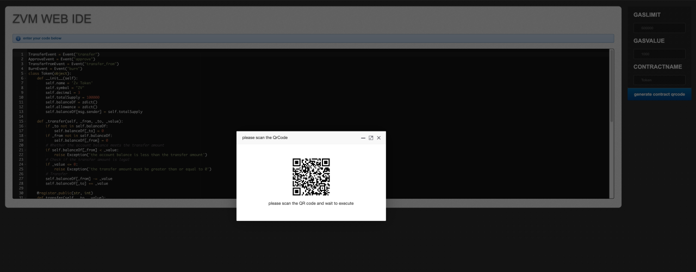

# WEB IDE

## 智能合约ide
 Chiron对外提供网页版IDE。开发者可在ide中编写调试python合约代码，设置部署合约时的gaslimit和gasprice参数，生成部署时需要的二维码。
 
 使用步骤：
 
  
将要测试的合约贴入web ide的代码框，在右边的contractname栏输入正确的合约名点击”generate contract qrcode”按钮，生成二维码。
 

[Click WEB IDE链接](https://webide.chiron.one/)